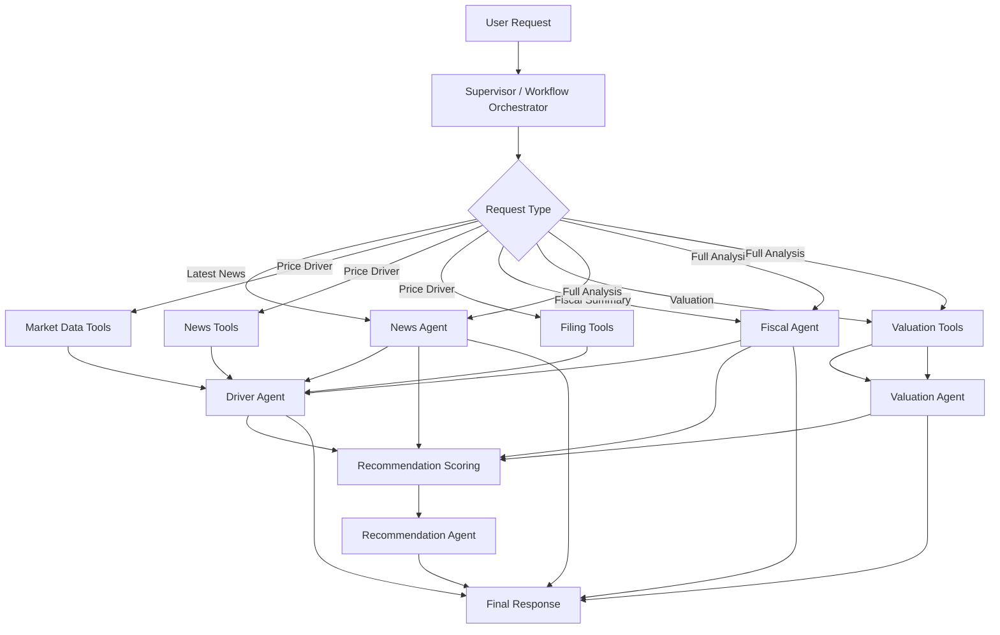
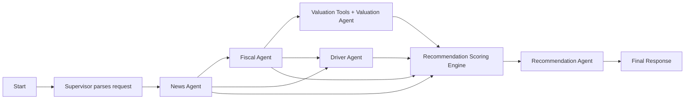

# Bartender v1 System Design

## Overview

Bartender is a **supervisor + workflow hybrid** stock research system built with **PydanticAI**.

The system supports five core user goals:
- get the most recent news,
- explain why a stock moved at a given time,
- summarize the latest fiscal report,
- evaluate stock value,
- produce a final buy / hold / sell recommendation.

## Design Principles

- **Supervisor-owned workflow**: routing, dependency management, and final synthesis are centralized.
- **Specialist agents**: each agent owns one bounded reasoning task.
- **Deterministic tools**: retrieval and calculations live in tools/clients, not in free-form agent reasoning.
- **Structured outputs**: all intermediate results use Pydantic models.
- **Multi-provider LLM access**: model/provider selection is abstracted behind shared infra.
- **Fixed v1 workflows**: the supervisor chooses one predefined workflow instead of freely inventing plans.

---

## Workflow Layer

The v1 request path is:

```text
User query
→ Supervisor detects intent
→ Supervisor selects one fixed workflow
→ Workflow executes predefined steps
→ Supervisor returns the workflow result
```

The supervisor maps intent to exactly one workflow:
- `news` → News Workflow
- `fiscal` → Fiscal Workflow
- `valuation` → Valuation Workflow
- `driver` → Driver Workflow
- `recommendation` → Recommendation Workflow

If multiple intents are present, the broader workflow wins:

```text
Recommendation > Driver > Valuation > Fiscal > News
```

Every workflow returns the same contract:
- `workflow_name`
- `ticker`
- `company_name`
- `user_intent`
- `selected_agents`
- `execution_status`
- `agent_outputs`
- `missing_data_warnings`
- `confidence_summary`
- `final_response_payload`

### Implemented v1 workflows

- News Workflow: runs News Agent for the requested ticker and time window.
- Fiscal Workflow: runs Fiscal Agent for the requested ticker.
- Valuation Workflow: runs Valuation Agent, which uses deterministic valuation tools.
- Driver Workflow: runs News Agent for context and returns warnings for missing price-driver infrastructure until Driver Agent and market/sector tools are implemented.
- Recommendation Workflow: runs News, Fiscal, and Valuation agents, then returns warnings until deterministic scoring and Recommendation Agent are implemented.

---

## High-Level Graph



---

## Workflow Graph for Full Analysis



---

## Agent Roles

### 1. Supervisor
**Role:** central controller.

**Responsibilities:**
- parse user intent,
- choose workflow,
- manage execution order,
- resolve dependencies between steps,
- store and pass intermediate artifacts,
- assemble the final response.

**Important note:**
The supervisor owns planning logic. There is **no separate planner agent in v1**.

---

### 2. News Agent
**Role:** recent news intelligence.

**Responsibilities:**
- retrieve and summarize recent stock/company news,
- identify key themes,
- tag event types,
- surface likely market-relevant developments.

**Input:** ticker, company name, time window.

**Output:** structured news summary, event list, sentiment/impact notes.

---

### 3. Driver Agent
**Role:** price movement attribution.

**Responsibilities:**
- explain why a stock rose or fell around a given date/time,
- combine price action, news, filings, and context,
- rank likely causes,
- separate evidence from inference.

**Input:** target time, market context, news artifacts, filing artifacts.

**Output:** primary driver, secondary drivers, confidence, explanation.

---

### 4. Fiscal Agent
**Role:** latest earnings / filing analysis.

**Responsibilities:**
- summarize the latest 10-Q, 10-K, 8-K, earnings release, or transcript,
- extract key metrics,
- capture management commentary,
- summarize guidance, risks, and notable changes.

**Input:** latest filing documents and financial data.

**Output:** structured fiscal summary and key metrics block.

---

### 5. Valuation Agent
**Role:** valuation interpretation.

**Responsibilities:**
- interpret deterministic valuation outputs,
- compare fair value vs current price,
- explain whether the stock looks cheap, fair, or expensive,
- frame bull/base/bear cases.

**Input:** valuation metrics, peer comparisons, historical ranges, DCF/fair value band.

**Output:** valuation summary and value view.

**Important note:**
The actual valuation math should come from tools, not from the LLM alone.

---

### 6. Recommendation Agent
**Role:** final narrative synthesis.

**Responsibilities:**
- combine upstream evidence,
- explain the bull and bear case,
- present the final investment view,
- communicate uncertainty and key risks.

**Input:** news summary, driver analysis, fiscal summary, valuation output, score output.

**Output:** final recommendation narrative.

**Important note:**
The final **buy / hold / sell label** should come from a deterministic scoring layer, with the agent explaining the result.

---

## Deterministic Components

These are not standalone agents.

### Market Data Tools
- price history
- returns / volatility
- benchmark and sector context
- volume spikes

### News Tools
- article retrieval
- source normalization
- deduplication

### Filing Tools
- SEC filing retrieval
- earnings release retrieval
- transcript retrieval
- filing parsing

### Valuation Tools
- multiple-based valuation
- DCF / fair value band
- peer comparison
- historical valuation range checks

**v1 implementation scope:**
- Source fundamentals and market data from `yfinance`.
- Source the risk-free-rate input from FRED's 10-year Treasury series when available, with a fixed fallback for offline runs.
- Use a manual peer ticker map for common large-cap names.
- Compute DCF from positive free cash flow, capped historical FCF growth, an 8-12% discount-rate heuristic, and a 2.5% terminal growth assumption.
- Compute relative value from peer median P/E, P/S, and EV/EBITDA where available.
- Compute reverse DCF by solving for the growth rate implied by the current stock price.
- Let the Valuation Agent explain the deterministic output; do not let it invent valuation math.

### Recommendation Scoring Engine
- weighted scoring
- buy / hold / sell label
- confidence score
- override rules

---

## Shared State

The workflow should maintain a structured state object.

Example artifact groups:
- request metadata,
- selected workflow,
- news summary,
- market context,
- filing summary,
- valuation result,
- driver analysis,
- recommendation score,
- final recommendation.

This state makes the system traceable, testable, and easier to debug.

---

## Suggested PydanticAI Mapping

### Agents
- `agents/supervisor.py`
- `agents/news.py`
- `agents/driver.py`
- `agents/fiscal.py`
- `agents/valuation.py`
- `agents/recommendation.py`

### Workflow
- `workflows/state.py`
- `workflows/full_analysis.py`
- `workflows/price_driver.py`
- `workflows/fiscal_summary.py`

### Infra
- `clients/llm.py`
- `clients/provider_registry.py`
- `tools/market_data.py`
- `tools/news.py`
- `tools/filings.py`
- `tools/valuation.py`
- `tools/scoring.py`

### Models
- `models/requests.py`
- `models/outputs.py`
- `models/domain.py`

---

## v1 Scope

### In scope
- supervisor + workflow orchestration,
- multi-provider LLM infra,
- recent news summary,
- fiscal summary,
- price-driver analysis,
- valuation interpretation,
- recommendation synthesis.

### Out of scope for now
- autonomous planner agent,
- agent-to-agent direct conversations,
- deep memory,
- portfolio-level optimization,
- advanced alternative data,
- frontend implementation.

---

## Final Recommendation

For v1, use:
- **Supervisor-owned workflow**,
- **specialist PydanticAI agents**,
- **deterministic tools for data and calculations**,
- **structured Pydantic outputs**,
- **a rule/scoring layer for buy/hold/sell**.

This gives you a system that is modular, testable, and easier to extend without overengineering the first version.
